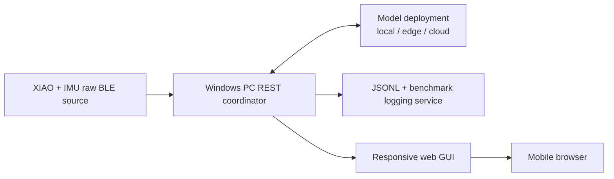

# IMU Rehabilitation Model-Deployment Benchmark

This project evaluates wrist-motion inference when a raw wearable IMU stream is
processed by a model deployed locally, on another edge device, or in the cloud.
The Windows PC client is the coordinator and serves the user interface directly
to a phone browser. No native mobile application is required.



## Repository layout

- `resource/inference_api/imu_raw_datastream_xiao_ble/`: primary XIAO firmware;
  continuously emits the 20-byte raw IMU packet at the model-native rate.
- `resource/inference_api/pc_client/`: REST coordinator, BLE source adapter,
  model deployment adapters, phone web GUI, and logging.
- `resource/inference_api/edge_runner/`: persistent local Windows C++ inference
  runner and deterministic Edge Impulse model preparation.
- `resource/inference_api/cloud_service/`: authenticated OCI inference service,
  native model build, health probes, and Prometheus latency metrics.
- `resource/inference_api/imu_datastream_ble/`: legacy onboard-inference firmware
  retained for standalone experiments, not used by the REST architecture.

The deployed model contract is 33 samples at 16.5 Hz in
`acc_x, acc_y, acc_z, gyro_x, gyro_y, gyro_z` order. Acceleration must remain in
g and gyroscope data in degrees/second; the model's raw DSP block does not apply
unit conversion. The PC validates sequence continuity and device timestamps
before accepting a window.

## Run the system

1. Flash `imu_raw_datastream_xiao_ble.ino` to the XIAO.
2. Build the local runner, or build the deployment-ready cloud container in
   `resource/inference_api/cloud_service/`.
3. Start the PC coordinator:

   ```powershell
   cd resource\inference_api\pc_client
   .\venv\Scripts\python.exe datastream_client.py serve --host 0.0.0.0 --port 8765
   ```

4. Configure the IMU and model at `http://127.0.0.1:8765`.
5. Open `http://<pc-ip>:8765/mobile` on the phone.

See [the PC client guide](resource/inference_api/pc_client/README.md) for model
REST contracts, API endpoints, build commands, and troubleshooting.
See [the cloud container guide](resource/inference_api/cloud_service/README.md)
for image builds, secrets, probes, deployment, and inference metrics.
