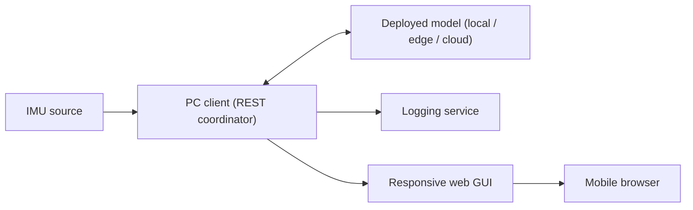

# IMU Rehabilitation REST Coordinator

The Windows PC client is the only application layer. It connects to the IMU,
invokes a selected model deployment, exposes a REST API and responsive web GUI,
and writes benchmark/event logs. The phone needs only a web browser.



## Components

- `imu_source.py`: continuous XIAO BLE IMU acquisition and 33-sample contiguous
  green-window capture.
- `model_backends.py`: local persistent C++ runner plus edge/cloud REST adapters.
- `inference_protocol.py`: model labels and the fixed 20-byte result packet.
- `datastream_client.py`: REST coordination, web pages, capture jobs, event feed,
  configuration, and logging service.
- `edge_runtime.py`: compatibility imports for older scripts; it is not the
  active architecture.

There is no Flutter application and no WebSocket endpoint.

## Model-native sampling contract

The checked-in Edge Impulse deployment is project `738400`, deployment `19`.
Its exported metadata is the authority for inference sampling:

- 33 samples at 16.5 Hz (`60.6060606 ms` per sample), nominally a two-second
  window;
- six values per sample and 198 float features per inference;
- feature order `acc_x, acc_y, acc_z, gyro_x, gyro_y, gyro_z`;
- acceleration in **g** (`raw / 16384`) and angular velocity in **degrees/second**
  (`raw / 131`);
- raw DSP processing with `scale_axes=1.0`, so no g-to-m/s² conversion is
  permitted before inference.

The PC accepts only the next 33 packets after a green-light capture starts. It
rejects sequence gaps, a mean timestamp cadence outside the model rate, and
individual sampling stalls. Invalid attempts do not advance the repetition.

## Install and run

From this directory:

```powershell
py -m venv venv
.\venv\Scripts\python.exe -m pip install -r requirements.txt
.\venv\Scripts\python.exe datastream_client.py serve --host 0.0.0.0 --port 8765
```

On the PC, open `http://127.0.0.1:8765`, select `XIAO raw BLE IMU`, scan for
`IMU-Raw-Stream`, configure the model deployment, and connect.

On a phone on the same LAN, open:

```text
http://<pc-ip>:8765/mobile
```

The mobile page owns the motion menu, get-ready/countdown/green states, ten
valid repetitions, Retry/Stop handling, HTTP result polling, and benchmark
submission.

## Model deployments

Result and benchmark deployment IDs are `0=local`, `1=edge`, and `2=cloud`.

### Local

Select `Local PC runner` and set the built executable path. Build it with:

```powershell
cd ..\edge_runner
cmake -S . -B build -G "MinGW Makefiles"
cmake --build build --config Release
```

The coordinator keeps the runner alive and speaks the existing `EIQ1`/`EIR1`
binary protocol.

### Edge or cloud

Select `Remote edge REST model` or `Cloud REST model` and provide an absolute
inference URL. An optional API key is sent as a bearer token and is never
returned by `/api/state`.

The repository includes a deployment-ready implementation of this endpoint in
[`../cloud_service/`](../cloud_service/README.md). It compiles deployment 19
into the image and exports native inference, queue, and request timing metrics.

The coordinator sends:

```json
{
  "version": 1,
  "window_id": 42,
  "feature_count": 198,
  "features": [0.0],
  "labels": [
    "Extension",
    "Flexion",
    "Pronation",
    "Radial Deviation",
    "Supination",
    "Ulnar Deviation"
  ],
  "warmup": false
}
```

`features` contains exactly 198 float values in the model-native order and units
listed above. The model endpoint returns either
a six-value score list in model order or a label-to-score object:

```json
{
  "ok": true,
  "scores": {
    "Extension": 0.05,
    "Flexion": 0.80,
    "Pronation": 0.05,
    "Radial Deviation": 0.04,
    "Supination": 0.03,
    "Ulnar Deviation": 0.03
  },
  "inference_us": 1200,
  "model_version": "deployment-19"
}
```

Setup performs one request with `warmup: true` before measured captures.

## REST API

```text
GET  /                         PC setup/dashboard
GET  /mobile                   phone session UI
GET  /api/health
GET  /api/sources
GET  /api/serial/ports
GET  /api/ble/devices
GET  /api/state
GET  /api/events?after_id=0
PUT  /api/config
POST /api/source/connect
POST /api/source/disconnect
POST /api/captures              enqueue idempotent capture
GET  /api/captures/{window_id}  poll capture state/result
POST /api/capture               blocking compatibility endpoint
POST /api/benchmarks/records
GET  /api/benchmarks/summary
GET  /api/benchmarks/export.csv
GET  /api/logs
```

`POST /api/captures` returns immediately. Repeating it with the same
`window_id` is safe. Polling returns HTTP 202 while pending, HTTP 200 with the
result, HTTP 409 for a failed capture, or HTTP 404 before the job exists.

## Logging

The logging service writes raw coordinator events to timestamped JSONL files
and deduplicated benchmark records to `benchmark_records.jsonl`. The dashboard
and CSV endpoint summarize capture, inference, end-to-end, and non-capture
latency by deployment, gesture, and model version.

## Tests

From the repository root:

```powershell
python -m unittest discover -s resource\inference_api\pc_client -p "test_*.py"
```
